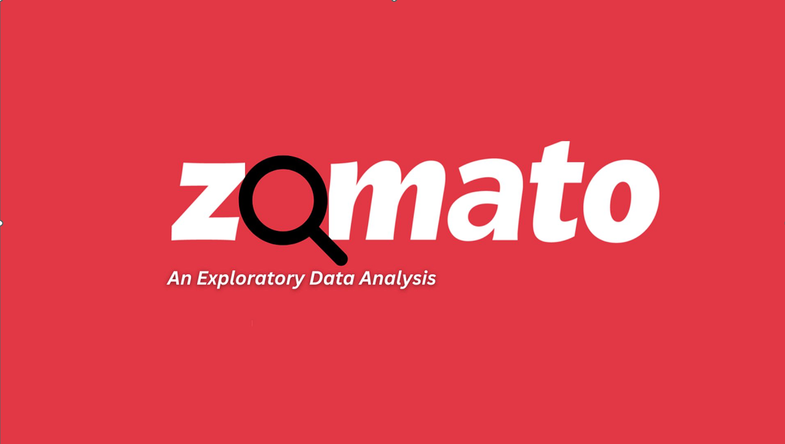
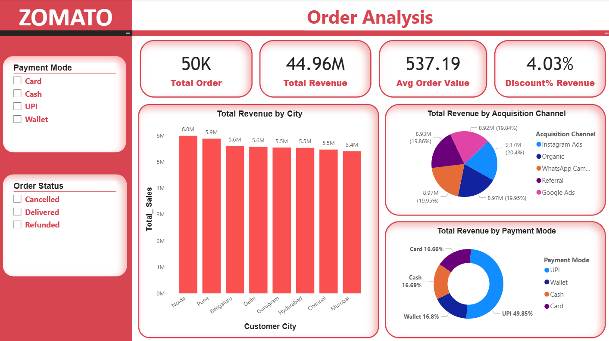
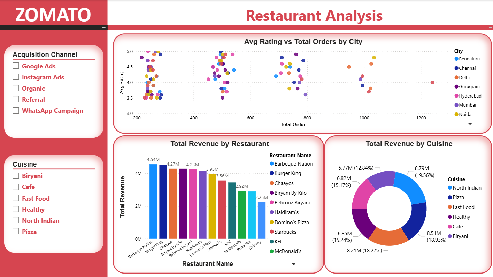
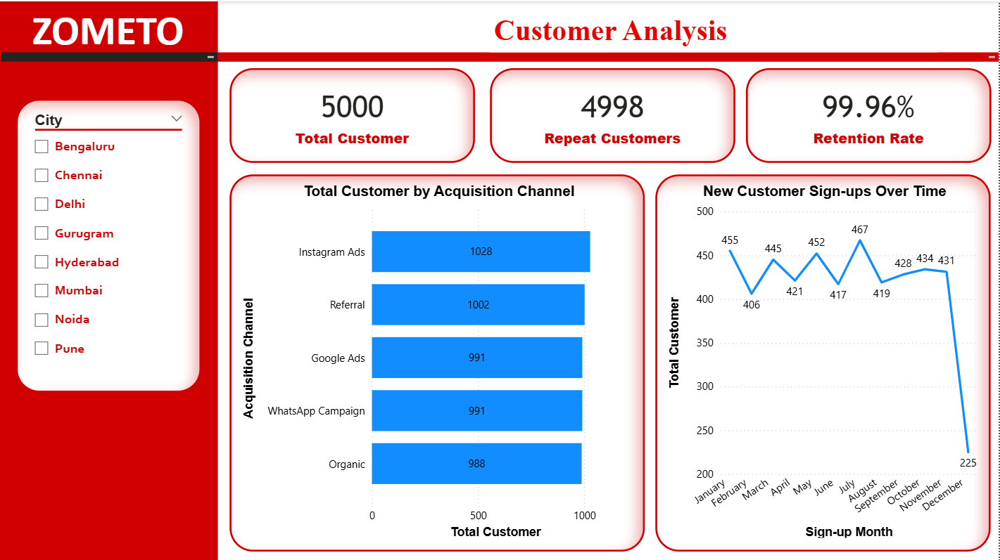
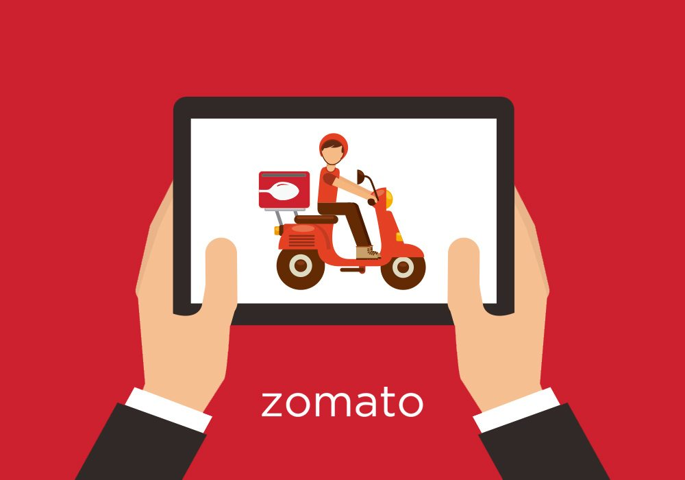

# 🍽️ Zomato Data Analysis Project (SQL + Power BI)

A data analyst portfolio project analyzing Zomato-style food delivery data using **MySQL** for querying and **Power BI** for building an interactive dashboard. The project covers order trends, revenue analysis, restaurant performance, and customer behavior across three relational tables.

---

## 📌 Project Overview

This project simulates a real-world food delivery business (Zomato-style) and answers key business questions that a Data Analyst at a company like Zomato, Swiggy, or any e-commerce platform would be expected to solve — using SQL for deep-dive analysis and Power BI for stakeholder-facing dashboards.

**Objective:** Analyze orders, restaurants, and customer data to uncover revenue trends, customer retention patterns, restaurant performance, and payment behavior.

---

## 🗂️ Dataset Schema

**1. Orders Table**
`order_id, customer_id, restaurant_id, order_date, order_amount, discount_amount, discount_percentage, delivery_fee, payment_mode, order_status`

**2. Restaurant Table**
`restaurant_id, restaurant_name, cuisine_type, city, avg_rating`

**3. Customer (cx) Table**
`customer_id, customer_name, city, signup_date, acquisition_channel`

---

## 🛠️ Tools Used
- **MySQL Workbench** — data querying, joins, CTEs, window functions
- **Power BI Desktop** — DAX measures, interactive dashboard, data modeling
- **Excel** — raw dataset source
- **PowerPoint** — query + result documentation, presentation of findings

---

## 📁 Repository Contents

| File | Description |
|---|---|
| `zometo.sql` | All SQL queries used for analysis (revenue, retention, city/cuisine breakdowns, etc.) |
| `Zomato Dataset.xlsx` | Raw dataset (Orders, Restaurant, Customer tables) |
| `Zometo.pbix` | Power BI dashboard file |
| `Zomato Quaries.pdf` | SQL queries + results documented |
| `Zomato Quaries.pptx` | Slide-by-slide walkthrough of SQL queries and outputs |
| `Dashboard1.png` – `Dashboard5.jpg` | Power BI dashboard page screenshots |

---

## 📊 Dashboard Structure (Power BI)

**Order Analysis:** Revenue trends, order status, payment mode, city-wise revenue 
**Restaurant & Cuisine Analysis:** Top restaurants, cuisine-wise revenue, rating vs order volume 
**Customer Analysis:** Retention rate, acquisition channel performance, sign-up trends 

## 🖼️ Dashboard Preview

---

## 🔍 Key Insights

1. **Total revenue generated: ₹44.96M** across **50,000 orders**, with an average order value (AOV) of **₹537.19**.

2. **Discounts account for only ~4% of total revenue**, indicating discounting is used selectively rather than as a primary growth lever.

3. **UPI is the dominant payment mode**, contributing **~49.85%** of total revenue — nearly 3x more than Cash, Card, or Wallet individually (each in the 16–17% range).

4. **Noida and Pune are the top revenue-generating cities** (~5.9M–6.0M), while **Mumbai generates the least** (~5.4M) among the tracked cities — a relatively narrow spread suggesting fairly even demand distribution across metros.

5. **North Indian cuisine leads restaurant revenue** (~19.6% share), closely followed by **Pizza (18.9%)** and **Fast Food (18.3%)** — the top 3 cuisines together make up over 55% of total restaurant revenue.

6. **Barbeque Nation, Burger King, and Chaayos are the top 3 revenue-generating restaurants**, each contributing well above ₹4M individually.

7. **Instagram Ads is the top-performing acquisition channel** both by customer count (1,028 customers) and revenue contribution (~20.4%) — narrowly ahead of Organic, WhatsApp Campaign, Google Ads, and Referral, all of which perform within a similar ~19.8–20% range.

8. **Customer acquisition is well-diversified** — no single channel dominates disproportionately; all 5 channels contribute nearly equal customer volume (~988–1028 customers each), reducing dependency risk on any one marketing channel.

9. **Retention rate is extremely high in this dataset (~99.96%)** — nearly all customers placed more than one order, indicating this is a synthetic/practice dataset rather than reflective of typical real-world food delivery retention (which usually ranges 30–60%).

10. **New customer sign-ups remained fairly stable through the year (400–470/month)** but dropped sharply in December (~225) — likely due to incomplete month-end data rather than an actual demand drop.

11. **Restaurant ratings show no strong linear relationship with order volume** — high-order restaurants exist across the full 3.5–5.0 rating range, suggesting factors beyond rating (like pricing, delivery speed, or brand recall) drive order volume.

12. **Revenue is spread fairly evenly across cuisines and cities**, with no single category commanding more than ~20% share — indicating a diversified, low-concentration-risk business model rather than dependence on one segment.

---

## 🧠 SQL Concepts Applied
- Joins (INNER JOIN across 3 tables)
- CTEs (`WITH` clauses) for layered analysis
- Window Functions (`OVER()`, running totals)
- CASE WHEN for segmentation (discounted vs non-discounted, same-city vs cross-city)
- Aggregate functions with `HAVING` and `GROUP BY`
- Retention rate & repeat customer analysis

## 📈 DAX Concepts Applied
- Basic measures (`SUM`, `DISTINCTCOUNT`, `AVERAGE`)
- `CALCULATE` with `FILTER` for conditional aggregation
- `DIVIDE` for safe percentage calculations
- `SWITCH(TRUE())` for customer segmentation
- `SUMMARIZE` + `TOPN` for dynamic "top category" measures

---

## 👤 Author
**Abdul Rehman**
Skills: SQL, Power BI, Excel, Python fundamentals, Power Point
